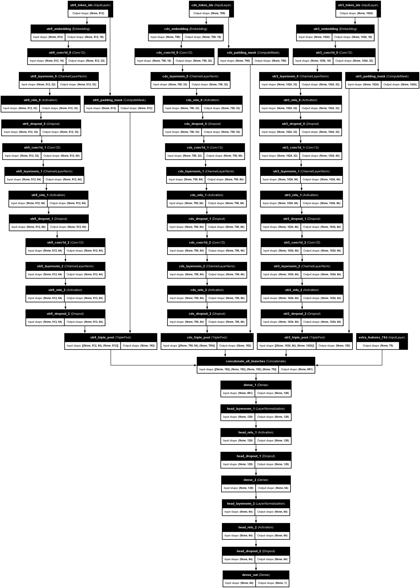
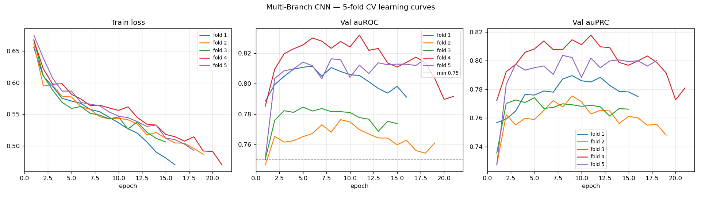

# mRNA Stability Prediction — Model Training

Codon-Aware Multi-Branch CNN (`mRNAStabilityNet`) for binary mRNA stability classification.

## Model Architecture



The model has **four parallel branches** that are concatenated and fed into a classification head:

| Branch | Input | Encoding | Conv Kernel | Output |
|--------|-------|----------|-------------|--------|
| **5'UTR** | Nucleotide sequence (max 512 nt) | Embedding(6, 16) | k=7, dilation 1/2/4 | 192d |
| **CDS** | Codon sequence (max 700 codons) | Embedding(66, 16) | k=5, dilation 1/2/4 | 192d |
| **3'UTR** | Nucleotide sequence (max 1024 nt) | Embedding(6, 16) | k=7, dilation 1/2/4 | 192d |
| **Features** | 75-dim engineered features | StandardScaler | — | 75d |

Each conv branch uses **3 dilated Conv1D blocks** (with ChannelLayerNorm + ReLU + Dropout)
followed by **triple pooling** (masked max + mean + attention) to produce a 192-d vector.

**Classification head:** Linear(651→128) → LayerNorm → ReLU → Dropout → Linear(128→64) → LayerNorm → ReLU → Dropout → Linear(64→1)

**Total trainable parameters:** 221,508

### Engineered Features (75-dim)

Feature Branch 的 75 維特徵向量由 `featurize()` 函數從原始 mRNA 序列（5'UTR、CDS、3'UTR）直接計算而來，不需要外部工具或資料庫。所有特徵在輸入模型前會經過 **per-fold StandardScaler** 正規化（減去訓練集均值、除以標準差）。

#### 11 維 Scalar Features

| # | 特徵名稱 | 計算方式 | 生物學意義 |
|---|---------|---------|-----------|
| 1 | `log_len_5utr` | `log1p(len(5'UTR))` | 5'UTR 長度（對數轉換以壓縮長尾分佈） |
| 2 | `log_len_cds` | `log1p(len(CDS))` | CDS 長度，較長的 CDS 通常有不同的穩定性 |
| 3 | `log_len_3utr` | `log1p(len(3'UTR))` | 3'UTR 長度，長 3'UTR 常含更多調控元件 |
| 4 | `gc_5utr` | `(G+C count) / len(5'UTR)` | 5'UTR 的 GC 含量，影響二級結構穩定性 |
| 5 | `gc_cds` | `(G+C count) / len(CDS)` | CDS 的 GC 含量，與翻譯效率及 mRNA 穩定性相關 |
| 6 | `gc_3utr` | `(G+C count) / len(3'UTR)` | 3'UTR 的 GC 含量 |
| 7 | `are_count` | `log1p(3'UTR 中 "AUUUA" 出現次數)` | AU-rich element (ARE) 是已知的 mRNA 去穩定化訊號，促進 mRNA 降解 |
| 8 | `uaug_count` | `log1p(5'UTR 中 "AUG" 出現次數)` | upstream AUG (uAUG) 會干擾主要 ORF 的翻譯起始，影響穩定性 |
| 9 | `ramp_gc` | `GC content of CDS[:90]` | 5' CDS ramp 區域（前 30 個密碼子）的 GC 含量，影響核醣體進入速率 |
| 10 | `ratio_3utr_cds` | `len(3'UTR) / (len(CDS) + 1)` | 3'UTR 與 CDS 的長度比，過長的 3'UTR 可能觸發 NMD 等降解途徑 |
| 11 | `ratio_5utr_cds` | `len(5'UTR) / (len(CDS) + 1)` | 5'UTR 與 CDS 的長度比 |

#### 64 維 Codon Frequency Vector

CDS 的密碼子使用頻率分佈，涵蓋所有 64 種三聯體密碼子（4³ = 64 種 A/C/G/U 組合）。

**計算方式：**
1. 將 CDS 序列按每 3 個核苷酸切割為密碼子（non-overlapping triplets）
2. 統計每種密碼子出現的次數
3. 除以總密碼子數量進行正規化，得到頻率分佈向量

**生物學意義：** 密碼子使用偏好（Codon Usage Bias）是 mRNA 穩定性的關鍵決定因素。同義密碼子（編碼相同胺基酸的不同密碼子）在翻譯效率和 mRNA 半衰期上有顯著差異：
- **最佳密碼子**（optimal codons）對應豐富的 tRNA，翻譯速度快，mRNA 較穩定
- **稀有密碼子**（rare codons）導致核醣體停滯，觸發 co-translational mRNA 降解

#### 特徵向量組裝流程

```
原始 mRNA 序列 (5'UTR + CDS + 3'UTR)
        │
        ├── 計算 11 個 scalar 特徵 ──┐
        │   (長度、GC、motif 計數)    │
        │                            ├── np.concatenate → 75-dim vector
        └── 計算 64-dim codon freq ──┘
                                      │
                                      ▼
                              StandardScaler
                         (per-fold 訓練集統計量)
                                      │
                                      ▼
                          模型 Feature Branch 輸入
```

> **實作位置：** `multibranch_cnn_model.py` 中的 `featurize()`, `_gc()`, `_codon_freq()` 函數

## Training

5-fold cross-validation with one model per fold, ensembled via probability averaging.

```bash
python train_multibranch_cnn.py
```

### Training Configuration

| Parameter | Value |
|-----------|-------|
| Optimizer | AdamW (lr=1e-3, weight_decay=1e-4) |
| Scheduler | CosineAnnealingLR |
| Loss | BCEWithLogitsLoss (class-weighted) |
| Batch size | 32 |
| Max epochs | 40 |
| Early stopping | patience=10, monitored by val auROC |
| Gradient clipping | max_norm=5.0 |
| Dropout | 0.3 |
| Seed | 42 |

### Learning Curves



All 5 folds converge stably with early stopping triggered between epochs 15–21.

## Results

### 5-Fold Cross-Validation (mean ± std)

| Metric | Score |
|--------|-------|
| **auROC** | **0.8041 ± 0.0207** |
| **auPRC** | **0.7900 ± 0.0176** |
| Recall | 0.8052 ± 0.0387 |
| Precision | 0.6937 ± 0.0214 |
| Specificity | 0.6679 ± 0.0368 |
| F1 | 0.7445 ± 0.0193 |
| Accuracy | 0.7339 ± 0.0185 |

### Per-Fold auROC

| Fold 1 | Fold 2 | Fold 3 | Fold 4 | Fold 5 |
|--------|--------|--------|--------|--------|
| 0.8115 | 0.7763 | 0.7846 | 0.8320 | 0.8163 |

**Grading check:** CV auROC 0.8041 ≥ 0.75 minimum threshold ✓

### OOF Overall

| Metric | Score |
|--------|-------|
| auROC | 0.7970 |
| auPRC | 0.7815 |
| F1 | 0.7317 |
| Threshold | 0.329 |

## Key Design Decisions

1. **Codon-level CDS encoding:** The CDS branch tokenizes at the codon level (66 tokens) instead of single nucleotides, directly capturing codon usage bias — a primary determinant of mRNA stability.
2. **Dilated convolutions:** Dilation rates of 1→2→4 expand the receptive field without increasing parameter count, allowing the model to capture long-range sequence patterns.
3. **ChannelLayerNorm:** Normalizes over channels rather than batch statistics, avoiding distortion from padded positions — critical when sequences vary greatly in length.
4. **Triple pooling:** Combining max, mean, and attention pooling retains complementary information from the sequence representation.
5. **Lightweight design:** ~221K parameters to reduce overfitting on the ~3,000-sample dataset.

## File Structure

```
Training/
├── multibranch_cnn_model.py      # Model + dataset + feature engineering
├── train_multibranch_cnn.py      # 5-fold CV training script
├── keras_multibranch_cnn.py      # Keras equivalent (for architecture diagram)
├── figures/
│   ├── keras_multibranch_cnn.png # Architecture diagram (plot_model)
│   ├── keras_multibranch_cnn.svg
│   ├── keras_multibranch_cnn.pdf
│   ├── learning_curves.png       # 5-fold CV learning curves
│   ├── multibranch_cnn_summary.png
│   └── multibranch_cnn_summary.txt
└── outputs_multibranch_cnn/
    ├── fold{1-5}_best.pt         # Trained checkpoints
    ├── cv_metrics.json           # Full metric suite
    ├── oof_predictions.csv       # Out-of-fold predictions
    ├── test_predictions.csv      # Ensembled test predictions
    └── learning_curves.png       # Learning curve plot
```

## Inference

```python
from multibranch_cnn_model import mRNAStabilityNet, mRNADataset, load_folds, load_test, DEFAULT_MAXLEN
import torch, glob, numpy as np

device = "cuda" if torch.cuda.is_available() else "cpu"
# Load all fold checkpoints and average predictions
ckpts = sorted(glob.glob("outputs_multibranch_cnn/fold*_best.pt"))
# ... (see train_multibranch_cnn.py for full inference loop)
```
